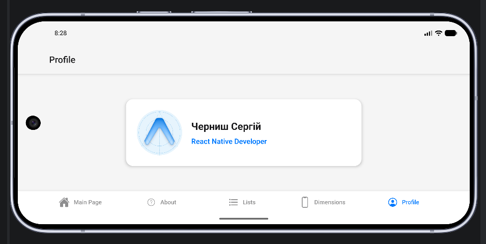
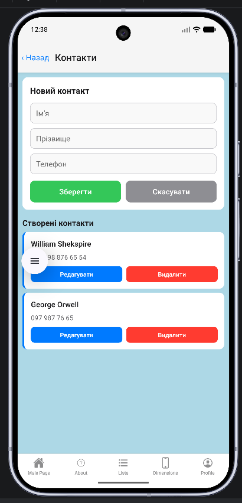
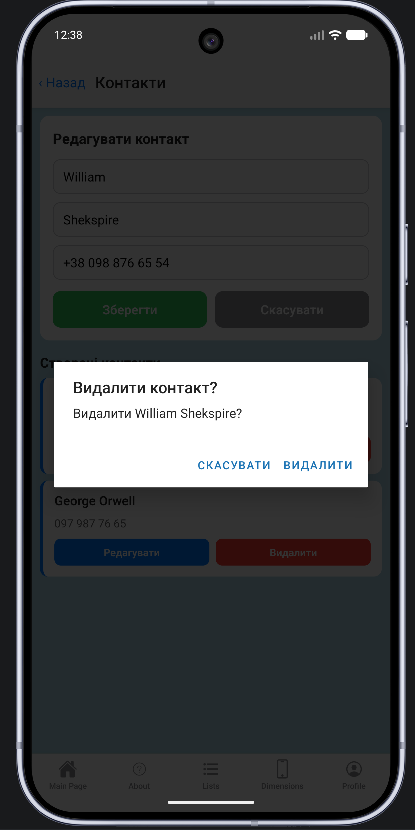
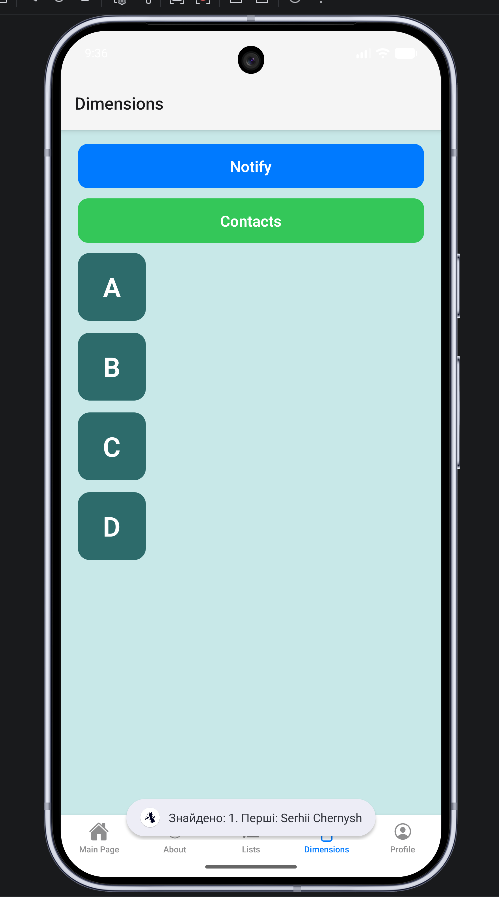
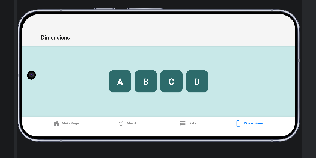

# React Native HW — Домашнее задание

Учебный проект на **Expo / React Native** с навигацией через `expo-router` (нижние табы) и экраном «Список задач» (CRUD с валидацией и подтверждением удаления).

## Стек

- [Expo](https://expo.dev) ~54
- React Native 0.81
- React 19
- [expo-router](https://docs.expo.dev/router/introduction/) — file-based роутинг
- [expo-contacts](https://docs.expo.dev/versions/latest/sdk/contacts/) — чтение и запись контактов устройства
- [expo-notifications](https://docs.expo.dev/versions/latest/sdk/notifications/) — локальные уведомления (на dev build; в Expo Go — Toast/Alert)
- TypeScript

## Структура приложения

```
app/
├── _layout.tsx          # корневой layout (Stack)
└── (tabs)/
    ├── _layout.tsx      # нижние табы (Main Page / About)
    ├── index.tsx        # главный экран — Welcome / кнопки / поля ввода
    ├── tasks.tsx        # экран «Список задач» (CRUD)
    ├── about.tsx        # экран «О приложении»
    ├── list.tsx         # SectionList с категориями
    ├── dimension.tsx    # Notify, Get contact, переход к контактам, карточки A–D
    ├── contacts.tsx     # форма и CRUD контактов (скрытый маршрут)
    └── profile.tsx      # адаптивная карточка профиля

hooks/
  useOrientation.ts      # 'portrait' | 'landscape'

components/
  profile-card.tsx       # карточка профиля (Черниш Сергій)
```

## Запуск

```bash
npm install
npm run start       # запустить Metro / Expo
npm run android     # Android
npm run ios         # iOS
npm run web         # Web
```

## Возможности

- Главный экран с приветствием, набором кнопок (`Subscribe`, `Show Toast`, `Default Button`), переключателем уведомлений и полем ввода.
- Переход на экран **«Список задач»** через кнопку.
- На экране задач:
  - добавление задачи (поддерживаются кириллица и латиница);
  - **валидация** — нельзя добавить пустую задачу (модалка «Помилка»);
  - **редактирование** задачи прямо в списке (кнопки «Зберегти» / «Скасувати»);
  - **удаление** с подтверждением (модалка «Видалити? Ви впевнені?»).
- Нижние табы: **Main Page**, **About**, **Lists**, **Dimensions**, **Profile**.
- Экран **About**: анимированный список, изображение с адаптацией под ориентацию.
- Экран **Lists**: `SectionList` с категориями в общей карточке.
- Экран **Dimensions**:
  - кнопка **Notify** — локальное уведомление «Hello: World» (в Expo Go — Toast/Alert);
  - кнопка **Get contact** — чтение контактов устройства (`expo-contacts`);
  - кнопка **Create new contact** — переход на экран **Контакти** (`router.push('/contacts')`);
  - карточки **A–D** — колонка в портрете, ряд в ландшафте (`width > 500`).
- Экран **Контакти** (`contacts.tsx`, скрытый маршрут — как «Список задач»):
  - форма **«Новий контакт»** / **«Редагувати контакт»** (ім'я, прізвище, телефон);
  - **валидация** — обязательно имя или фамилия;
  - **создание** — `addContactAsync`, список «Створені контакти»;
  - **редактирование** — `updateContactAsync`;
  - **удаление** — подтверждение «Видалити контакт?» и `removeContactAsync`;
  - кнопка **«‹ Назад»** — возврат на Dimensions.
- Экран **Profile**: адаптивная карточка профиля (Черниш Сергій) через хук `useOrientation()` — подробнее в [docs/profile-orientation-task.md](docs/profile-orientation-task.md).

### Разрешения (Android)

В `app.json` подключён плагин `expo-contacts` с разрешениями `READ_CONTACTS` и `WRITE_CONTACTS`. При первом обращении к контактам приложение запрашивает доступ у пользователя.

## Скриншоты

### 1. Главный экран (Main Page)

Стартовый экран с кнопками и переходом к списку задач.


### 2. Экран «Список задач»

Поле ввода новой задачи, кнопка «Додати» и список существующих задач с кнопками «Редагувати» / «Видалити».


### 3. Валидация пустого ввода

При попытке добавить пустую задачу появляется модальное окно с ошибкой.


### 4. Режим редактирования задачи

При нажатии «Редагувати» задача превращается в редактируемое поле с кнопками «Зберегти» и «Скасувати».


### 5. Подтверждение удаления

При нажатии «Видалити» появляется модалка с подтверждением.


### 6. Список после удаления

После подтверждения задача удаляется из списка.


### 7. Profile — портретная ориентация

Аватар сверху, текст (Черниш Сергій, React Native Developer) снизу.


### 8. Profile — ландшафтная ориентация

Аватар слева, текст справа.



### 9. Контакти — форма и список

Экран «Контакти» открывается с **Dimensions** по кнопке **Create new contact**. Форма «Новий контакт» и список «Створені контакти» с кнопками **Редагувати** / **Видалити**.



### 10. Контакти — редактирование и удаление

Режим «Редагувати контакт»; подтверждение «Видалити контакт?» перед удалением из адресной книги.



### 11. Dimensions — Get contact

Чтение контактов устройства через `expo-contacts`; уведомление с именем найденного контакта.



### 12. Dimensions — карточки A–D в ландшафте

Четыре карточки в ряд при ширине экрана больше 500 px.



## Выполненная работа (сводка)

| Задача | Реализация |
|--------|------------|
| Lists | `SectionList` с секциями, карточка, safe area, StatusBar |
| About | анимированный список, изображение Samuray.jpg, адаптация под ориентацию |
| Dimensions — layout | карточки A–D: column / row по `useWindowDimensions` |
| Dimensions — Notify | `expo-notifications` (dynamic import), fallback в Expo Go |
| Dimensions — контакты | CRUD на экране `contacts.tsx`, переход с Dimensions |
| Profile | отдельная вкладка, `ProfileCard` + `useOrientation()` |
| Документация | README, скриншоты 01–12, [docs/profile-orientation-task.md](docs/profile-orientation-task.md) |

Репозиторий: [Teslyar75/React_Native_HW](https://github.com/Teslyar75/React_Native_HW)
