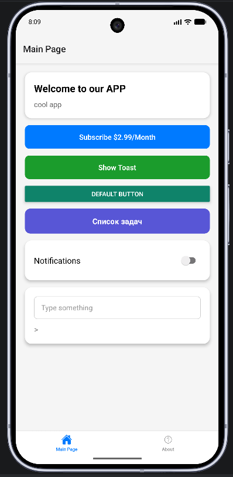
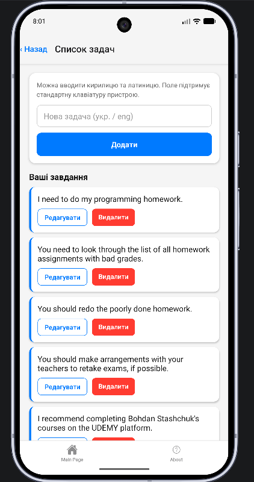
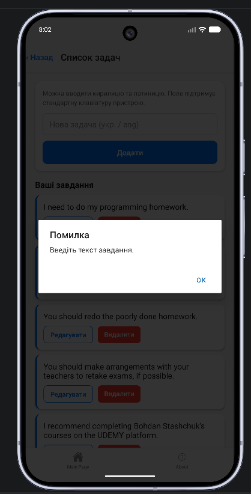
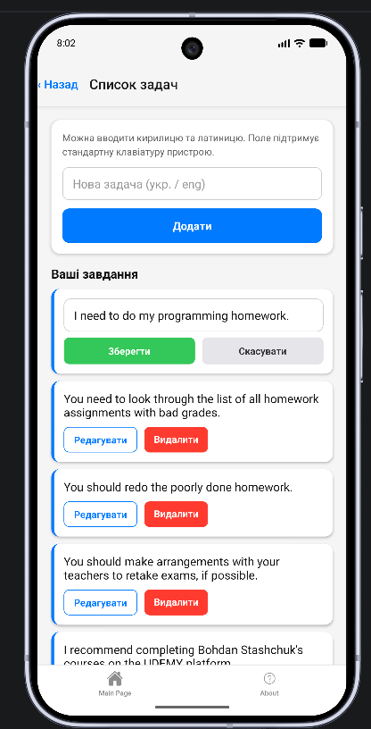
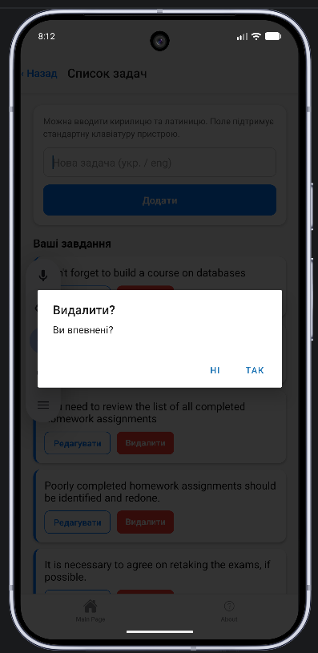
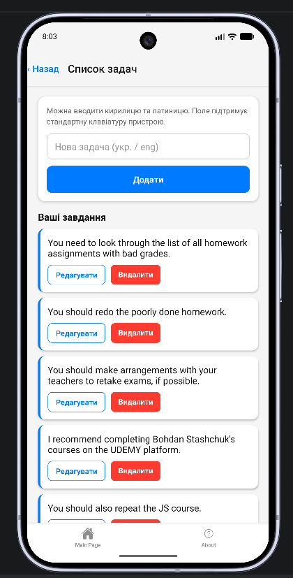

# React Native HW — Домашнее задание

Учебный проект на **Expo / React Native** с навигацией через `expo-router` (нижние табы) и экраном «Список задач» (CRUD с валидацией и подтверждением удаления).

## Стек

- [Expo](https://expo.dev) ~54
- React Native 0.81
- React 19
- [expo-router](https://docs.expo.dev/router/introduction/) — file-based роутинг
- TypeScript

## Структура приложения

```
app/
├── _layout.tsx          # корневой layout (Stack)
└── (tabs)/
    ├── _layout.tsx      # нижние табы (Main Page / About)
    ├── index.tsx        # главный экран — Welcome / кнопки / поля ввода
    ├── tasks.tsx        # экран «Список задач» (CRUD)
    └── about.tsx        # экран «О приложении»
```

## Запуск

```bash
npm install
npm run start       # запустить Metro / Expo
npm run android     # Android
npm run ios         # iOS
npm run web         # Web
```

## Возможности

- Главный экран с приветствием, набором кнопок (`Subscribe`, `Show Toast`, `Default Button`), переключателем уведомлений и полем ввода.
- Переход на экран **«Список задач»** через кнопку.
- На экране задач:
  - добавление задачи (поддерживаются кириллица и латиница);
  - **валидация** — нельзя добавить пустую задачу (модалка «Помилка»);
  - **редактирование** задачи прямо в списке (кнопки «Зберегти» / «Скасувати»);
  - **удаление** с подтверждением (модалка «Видалити? Ви впевнені?»).
- Нижние табы: **Main Page** и **About**.

## Скриншоты

### 1. Главный экран (Main Page)

Стартовый экран с кнопками и переходом к списку задач.



### 2. Экран «Список задач»

Поле ввода новой задачи, кнопка «Додати» и список существующих задач с кнопками «Редагувати» / «Видалити».



### 3. Валидация пустого ввода

При попытке добавить пустую задачу появляется модальное окно с ошибкой.



### 4. Режим редактирования задачи

При нажатии «Редагувати» задача превращается в редактируемое поле с кнопками «Зберегти» и «Скасувати».



### 5. Подтверждение удаления

При нажатии «Видалити» появляется модалка с подтверждением.



### 6. Список после удаления

После подтверждения задача удаляется из списка.


