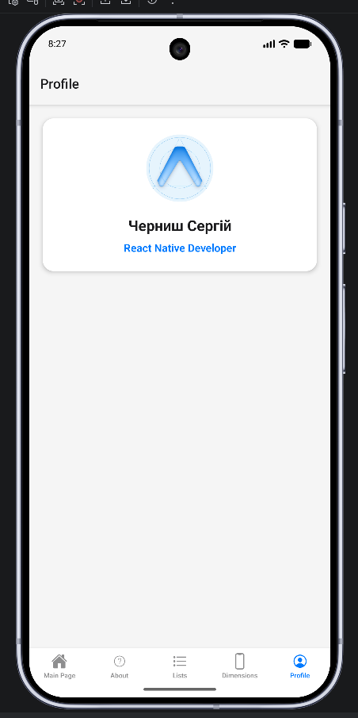

# Описание выполненной работы: адаптивная карточка профиля

## Задание

1. Создать адаптивную карточку профиля:
   - в портретной ориентации — аватар сверху, текст снизу;
   - в ландшафтной — аватар слева, текст справа.
2. Реализовать хук `useOrientation()`, возвращающий `'portrait'` или `'landscape'`, и использовать его для изменения стилей или компоновки.

## Статус: выполнено

| Требование | Статус | Где реализовано |
|------------|--------|-----------------|
| Аватар сверху, текст снизу (портрет) | ✅ | `components/profile-card.tsx` — стили `cardPortrait`, `infoPortrait` |
| Аватар слева, текст справа (ландшафт) | ✅ | `components/profile-card.tsx` — стили `cardLandscape`, `infoLandscape` |
| Хук `useOrientation()` | ✅ | `hooks/useOrientation.ts` |
| Использование хука для вёрстки/стилей | ✅ | `profile-card.tsx`, `app/(tabs)/profile.tsx` |
| Отдельный экран (не Dimensions) | ✅ | `app/(tabs)/profile.tsx` |

Экран **Dimensions** (`dimension.tsx`) не изменялся по смыслу задания — карточки A/B/C/D и переключение row/column остались на отдельной вкладке.

---

## Структура файлов

```
hooks/
  useOrientation.ts          — хук ориентации

components/
  profile-card.tsx           — адаптивная карточка профиля

app/(tabs)/
  profile.tsx                — экран вкладки Profile
  _layout.tsx                — вкладка Profile в нижней навигации

app.json                     — "orientation": "default" (разрешён поворот экрана)
```

---

## 1. Хук `useOrientation()`

**Файл:** `hooks/useOrientation.ts`

- Использует `useWindowDimensions()` из React Native.
- Сравнивает ширину и высоту окна:
  - `width > height` → `'landscape'`;
  - иначе → `'portrait'`.
- При повороте устройства размеры обновляются, компоненты перерисовываются автоматически.

```ts
export type Orientation = "portrait" | "landscape";

export function useOrientation(): Orientation {
  const { width, height } = useWindowDimensions();
  return width > height ? "landscape" : "portrait";
}
```

---

## 2. Адаптивная карточка профиля

**Файл:** `components/profile-card.tsx`

**Содержимое карточки:**

- круглый аватар (`assets/images/icon.png`);
- имя: **Черниш Сергій**;
- роль: React Native Developer.

**Портрет (`orientation === 'portrait'`):**

- `flexDirection: 'column'` — блоки друг под другом;
- аватар сверху, текстовый блок снизу;
- выравнивание по центру.

**Ландшафт (`orientation === 'landscape'`):**

- `flexDirection: 'row'` — аватар и текст в одну строку;
- аватар слева, текст справа (`flex: 1` у блока с текстом);
- текст выровнен влево (`textLandscape`).

---

## 3. Экран Profile

**Файл:** `app/(tabs)/profile.tsx`

- Рендерит `<ProfileCard />`.
- Дополнительно использует `useOrientation()` для центрирования карточки по вертикали в ландшафте (`containerLandscape`).

**Навигация:** вкладка **Profile** в `app/(tabs)/_layout.tsx`, иконка `person-circle-outline`.

---

## Скриншоты

### Портретная ориентация

Аватар сверху, имя и роль снизу.



### Ландшафтная ориентация

Аватар слева, текст справа.


---

## Как проверить

1. Запустить приложение: `npm run android` или `npx expo start`.
2. Открыть вкладку **Profile**.
3. **Портрет:** аватар над именем и ролью.
4. Повернуть эмулятор/телефон в альбомную ориентацию — аватар слева, текст справа.
5. Убедиться, что вкладка **Dimensions** по-прежнему показывает карточки A, B, C, D.

---

## Итог

Оба пункта задания реализованы: собственный хук ориентации и адаптивная карточка профиля с разной компоновкой в портрете и ландшафте. Логика вынесена в переиспользуемые модули (`useOrientation`, `ProfileCard`), экран — отдельная вкладка `profile.tsx`.
